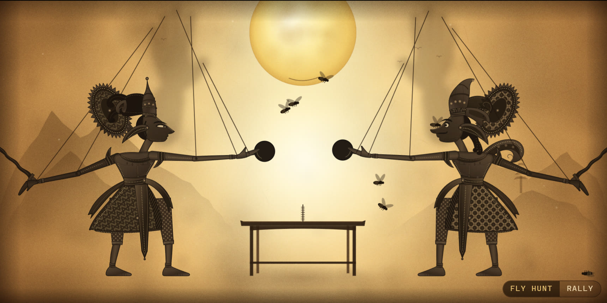
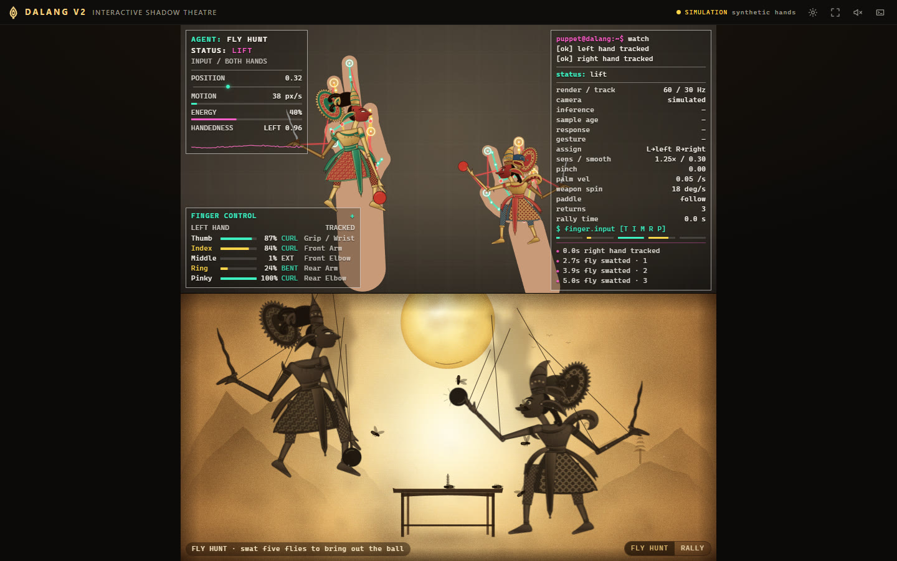
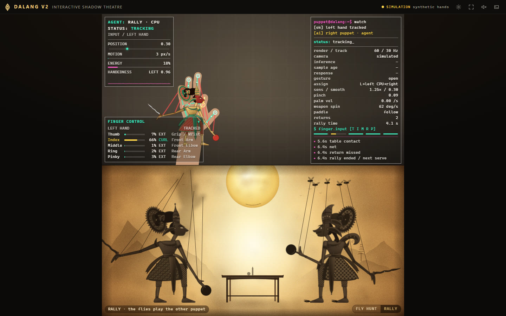
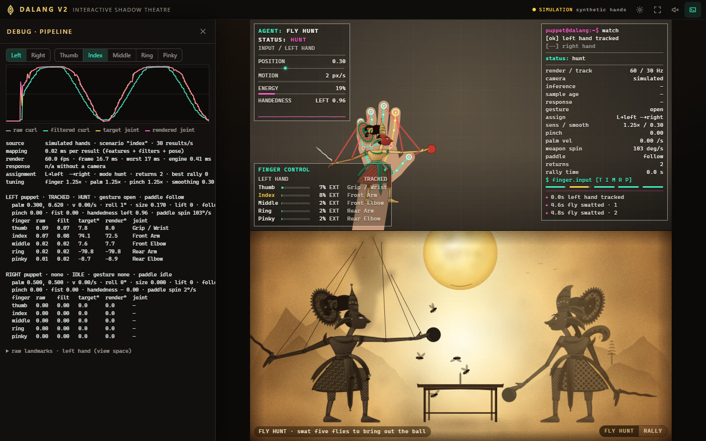
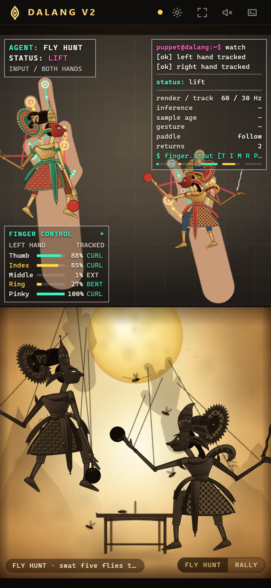

<div align="center">

# DALANG V2

### An interactive Wayang shadow theatre where every finger pulls a string

Raise your hands to the webcam. Each hand holds one puppet, each finger turns
one joint, and a miniature of the puppet rides on your hand so you can see
what your fingers are doing.

[**Live demo**](https://dalangv2.hongvan.net) ·
[How to play](#how-to-play) ·
[How it works](#how-it-works) ·
[Deploying](DEPLOY.md)



</div>

DALANG V2 is a new, independent project. It reuses the proven tracking core of
[DALANG V1](https://github.com/lahieuphong/dalang) (frame scheduling, inference
backends, the noise-aware filter, hand assignment and the head / arm artwork)
and rebuilds everything around it: the camera-over-stage layout, the miniature
puppets and strings, the HUDs, a jointed rig with legs and props, a stage with
things to do, calibration, scripted simulation and a test suite.

## Screenshots

| | |
| --- | --- |
|  |  |
| Camera above, stage below, the same width. | One hand plays; the flies fly the other puppet. |
|  |  |
| `?debug=1`: raw vs filtered vs target vs rendered. | Phone. |

## Quick start

You need a current Node.js LTS release and [Yarn](https://classic.yarnpkg.com/) 1.x.

```bash
yarn install
yarn dev            # http://localhost:5173
```

| Command          | What it does                                             |
| ---------------- | -------------------------------------------------------- |
| `yarn dev`       | Development server with hot reload                       |
| `yarn build`     | Type-check, then build the production site into `dist/`  |
| `yarn preview`   | Serve the production build locally                       |
| `yarn typecheck` | Type-check only (TypeScript strict)                      |
| `yarn test`      | Unit and pipeline tests (Vitest)                         |

`yarn dev` and `yarn build` first run `scripts/setup-mediapipe.mjs`, which
copies the MediaPipe WASM runtime from `node_modules` into
`public/mediapipe/wasm` and downloads `public/models/hand_landmarker.task` if
it is missing.

The camera needs a secure context: `localhost` or HTTPS. No camera at hand?
Open `http://localhost:5173/?simulate=1`.

## How to play

Sit so your hands fit in the camera view, palms toward the camera. **Good
light matters**: a webcam in a dim room quietly drops to 15 frames a second,
and no software gets those frames back (the app tells you when this happens).

Each hand holds one puppet: the hand on the left of the preview holds the left
puppet. Nothing has to be held or timed. Every channel is continuous.

| Your hand                  | The puppet                                                                 |
| -------------------------- | -------------------------------------------------------------------------- |
| Palm left / right          | Walks across its side of the stage                                         |
| Palm up / down             | Lifts off the ground; pressing down folds its knees                        |
| Palm toward the camera     | Comes toward the lamp: larger                                              |
| Wrist roll                 | Leans the body                                                             |
| **Thumb**                  | Front wrist (angles the paddle) and grip                                   |
| **Index**                  | Front shoulder: straight raises the arm, bending lowers it, pointing aims it |
| **Middle**                 | Front elbow                                                                |
| **Ring**                   | Back shoulder: straight lifts the arm out behind                           |
| **Little finger**          | Back elbow: bending raises the keris                                       |
| **Thumb + index pinch**    | Grip, closing gradually over the whole approach of the fingertips; catches the ball or a fly, opening lets go (that is a serve) |

A string runs from each fingertip to the far end of the bone that finger
turns, on the miniature over the camera and on the stage alike, so the mapping
can be read off the screen. The mapping is a table and can be changed under
**Settings → Interaction → Finger mapping**.

### The stage

- **Fly hunt.** Flies drift within reach. Swing the paddle through one to
  knock it down; a slow paddle only shoos it away.
- **Rally.** After five swats (or the `RALLY` button) a ball is served over
  the low table. Meet it with the paddle.
- **One hand.** With only one hand playing, five flies pick up the other
  puppet's strings and return the ball. Their aim drifts the longer a rally
  lasts. Switch this off under Settings → Interaction → Stage partner.

The status word comes from a small state machine fed by real conditions:
`IDLE`, `TRACKING`, `LIFT`, `HUNT`, `RALLY`, `INTERACT` (the pinch holds
something), `RECOVER` (tracking lost: pose held, then eased to rest).

### On screen

- **Status HUD** (top left): what the stage is running, the performing
  hand's state, palm position, palm speed, an energy level and MediaPipe's
  handedness score (the only per-hand score the model reports; it is labelled
  as exactly that).
- **Diagnostics HUD** (right): render rate and tracking rate as two separate
  measurements, inference time, sample age, response, gesture, assignment,
  gains, pinch, palm velocity, paddle spin, and the event log.
- **Finger Control Monitor** (bottom left): per finger, curl 0–100 %, state
  (`EXT` / `BENT` / `CURL`, `OUT` while a fingertip is outside the frame,
  `NO HAND` when there is none) and the joint it drives. Click the header to
  show both hands.

Click a HUD's header to collapse it; all three can be switched off in
Settings. Nothing shown is simulated or hard-coded: a value that cannot be
measured reads `–`.

## Settings

| Section     | Controls                                                                                              |
| ----------- | ----------------------------------------------------------------------------------------------------- |
| Camera      | Start / stop, choose camera, flip front / back, mirror, tracking overlay                               |
| Tracking    | Finger, palm and pinch sensitivity; smoothing; under *More*: lean and depth sensitivity, detection and tracking thresholds, hold-after-loss |
| Display     | Hand skeleton, miniature puppets, finger values, status HUD, debug HUD, fullscreen, quality preset     |
| Interaction | Swap puppet assignment, invert vertical control, stage partner, finger mapping, calibrate / reset, gesture guide |

**Sensitivity is not smoothing.** Sensitivity is how far the puppet moves for
a given movement of the hand (a gain, 0.75× to 1.75×). Smoothing is how firmly
a resting hand is held still. Neither stands in for the other, and the
defaults are already the fast setting.

**Quality presets** only trade secondary rendering (pixel ratio, soft hand
shadows, translucent leather, cast shadows, dust). No preset removes a puppet,
a prop or a finger channel.

**Calibration** (optional, about ten seconds): show a hand, open it, close it,
move it around. It fits each finger's 0–100 % to your hand at your camera
angle and the stage to the area you move in. It is saved on the device; you
are never asked again unless you reset it.

## Developer flags

Add these to the URL. They combine.

| Flag                                | Effect                                                                            |
| ----------------------------------- | --------------------------------------------------------------------------------- |
| `?simulate=1`                       | Synthetic hands instead of the camera (the demo reel)                             |
| `?script=<name>`                    | One simulated scenario: `thumb` `index` `middle` `ring` `pinky` `pinch` `lift` `fast` `still` `loss` `two` `cross` |
| `?noise=0.0012`                     | Simulated landmark noise, in frame units (default 0.0012 ≈ a decent webcam)       |
| `?fps=15`                           | Simulated tracker rate                                                            |
| `?debug=1`                          | The debug view; also exposes the engine as `window.__dalang`                      |
| `?tracker=main` / `?tracker=worker` | Pin where the model runs                                                          |
| `?delegate=cpu`                     | Force the CPU delegate                                                            |
| `?hud=0`                            | Hide every overlay (clean screenshots)                                            |

Simulated hands are 21 image and world landmarks built from a parametric hand.
They enter the pipeline at hand assignment, so features, filtering, gestures,
mapping, followers and rendering all run exactly as they do with a camera.

The debug view plots one finger's **raw curl, filtered curl, joint target and
rendered joint** on one time axis: any lag from the filter shows between the
first two lines, any lag from the followers between the last two.

## How it works

```
camera frame ─▶ hand landmarker ─▶ hand assignment ─▶ per-finger features
   ─▶ calibration ─▶ noise-aware filtering ─▶ gestures ─▶ pose mapping
   ─▶ display-rate followers ─▶ legs + follow-through ─▶ SVG / canvas
```

| Stage       | Module                                         | What it does                                                                                     |
| ----------- | ---------------------------------------------- | ------------------------------------------------------------------------------------------------ |
| Camera      | `tracking/CameraManager`                       | Asks for ~640×480 at 50–60 fps, then 30 fps, then anything; reports the mode actually granted      |
| Tracking    | `tracking/HandTracker`, `InferenceBackend`     | MediaPipe Hand Landmarker (GPU, CPU fallback), driven by `requestVideoFrameCallback`; never queues a frame, never runs two inferences at once |
| Assignment  | `tracking/HandAssignment`                      | Screen side for a new hand, motion continuity for a tracked one, handedness as a tie-breaker       |
| Features    | `tracking/FingerGeometry`, `HandFeatures`      | Curl per finger from joint angles in the finger's own flexion plane; thumb on its own anatomy; pinch, spread, roll, pitch, yaw, depth, all scaled by the hand's own size |
| Filtering   | `tracking/TrackingFilters`, `OneEuroFilter`    | One noise-aware One Euro filter per channel; a spike guard; out-of-frame fingers are held          |
| Gestures    | `motion/GestureEngine`                         | Pinch, fist, point, open, with hysteresis. They only add behaviour                                  |
| Mapping     | `motion/PuppetMapping`                         | Response curve × gain; finger → joint by table; palm → root                                         |
| Motion      | `motion/PuppetController`, `Locomotion`        | Stiff critically damped followers; palm prediction; procedural legs, cloth and follow-through      |
| States      | `motion/InteractionStateMachine`               | One word per puppet, with dwell times                                                              |
| Scene       | `scene/SceneController`, `motion/AgentPuppeteer` | Flies, ball, table collisions; the stage's own puppeteer                                         |
| Rendering   | `components/*`, `scene/Backdrop`, `StageFx`    | Articulated SVG puppets driven by transforms; canvas for skeleton, strings, flies, ball; a backdrop painted once |

### What makes it responsive

- **Frames are never queued.** Each camera frame is offered once; if the
  model is busy the frame only replaces the one waiting. On the main thread
  the result drives the very next render frame.
- **One smoothing stage, and it knows the noise.** Each channel's filter
  measures that channel's own noise. A change larger than 3 σ passes on the
  frame it is seen; smaller ones still pass, over a few frames. There is no
  dead zone and no debounce.
- **Small movements are amplified, not thresholded.** Curl goes through a
  response curve with slope 1.8 at zero that still ends at exactly 1
  (0.1 → 0.17, 0.5 → 0.64). The ring and little fingers get extra gain.
- **The pinch is linear over the whole approach** of thumb and index, gated
  so that an index finger merely folding into the palm is not read as one.
- **Followers upsample, they do not smooth.** Between tracker results the
  pose is carried to the display rate by critically damped followers with a
  time constant near 10 ms, integrated exactly, so they never ring.
- **The palm is predicted** a few milliseconds ahead along its velocity, and
  the prediction is dropped when the hand reverses.
- **Sparse tracking is handled.** Below 30 results a second the prediction
  horizon grows and the followers ease slightly, so a 15 fps camera gives
  continuous motion instead of move-stop-move (see the numbers below).
- **Gestures never override channels.** A fist needs all four fingers
  (it is built on the least curled one); pointing needs the other three
  curled. One finger moving alone leaves both at zero.
- **Physics is decoration.** Legs, cloth, the ornament and arm follow-through
  are computed after the followers and never feed back into control.
- **React stays out of the frame.** One `requestAnimationFrame` loop; all
  per-frame state in plain objects; SVG transforms and canvases written
  imperatively; HUD text at 5 Hz, finger bars per tracker result.

## Measured

Production build, headless Chrome, i9-12900K + RTX 3090, 1440×900.

**Real inference, recorded 640×480 / 30 fps clip fed in as the camera**

| Where the model runs      | Tracking | Inference | Capture → pose target | Render            |
| ------------------------- | -------- | --------- | --------------------- | ----------------- |
| Main thread, GPU (default) | 29.5 Hz  | 11.8 ms (8.0–17.2) | 20.1 ms (16.6–25.1) | 59.4 fps; worst frame per second typically 17 ms, up to 50 ms |
| Worker, GPU (`?tracker=worker`) | 30.0 Hz | 17.1 ms | 35.8 ms               | 60.0 fps, worst 17 ms |
| Main thread, CPU (`?delegate=cpu`) | 18.6 Hz | 32.8 ms | 42.8 ms            | 47.7 fps          |

Capture → page was 7.7 ms; the engine itself costs 0.2 ms per render frame and
feature extraction + filtering + mapping under 0.1 ms per result. The app
starts on the main thread and auditions a worker by itself when inference
stays above 32 ms.

**Physical webcam (Logitech C922), nobody in view**

The browser granted 640×480 @ 60, but the camera delivered **14.9 fps**, in
all eight modes tried from 320×240 to 1280×720 and with manual exposure. That
is the camera's own low-light behaviour (or a closed shutter) at the time of
the test, not something a page can change. Tracking followed every frame it
got: 14.9 Hz, 13.8 ms inference, 25 ms capture → pose, 60.0 fps render. The
app showed its slow-camera notice.

**Pipeline, simulated landmarks (66 automated tests)**

| What                                                         | Result                                              |
| ------------------------------------------------------------ | --------------------------------------------------- |
| One finger bent alone: travel of its own joint               | 71–79° (thumb → wrist 31°)                          |
| … travel of the other four joints                            | 0.0° (a fully curling index nudges the wrist 3.5°)  |
| Hand appears → puppet fully in hand                          | under 150 ms                                        |
| Still hand, landmark noise σ = 0.0012: root                  | 0.2 stage units of 1200 (std)                       |
| … shoulder / back elbow / wrist                              | 0.56° / 0.73° / 0.89° (std)                         |
| Hand shaking at 1.4 Hz: rendered root behind its target      | under 26 stage units, follower lag under 25 ms      |
| Hand lost: largest step while held and easing                | under 3 stage units per frame                       |
| Steady lift at 30 results/s: unevenness of rendered speed    | 0.05                                                |
| … at 15 results/s, with / without the sparse-tracking easing | 0.16, no stalled frames / 0.72, 26 % of frames stalled |

**Not measured, and why**

- A real hand in front of a physical webcam. The automated runs had no hand
  to show the camera; the recorded clip is a screen recording with overlays
  drawn over the hand, so the model only held it for part of the time. Finger
  accuracy on real hands rests on the V1 geometry (tuned on a real webcam) and
  on these synthetic tests. **Please run acceptance tests 1–11 by hand.**
- The physical latency of the camera before the browser sees a frame.
  JavaScript can only see `capture→page` where the browser reports it.
- A 60 fps camera path, phones and tablets, Safari and Firefox, and sessions
  longer than a minute (heap stayed at 16–20 MB over each run).

## Tests

```bash
yarn test
```

- `tests/fingers.test.ts`: each finger alone, continuity, distance and side invariance, pinch, fingers out of frame.
- `tests/mapping.test.ts`: finger → joint independence, slight bends, custom maps, palm → stage.
- `tests/tracking.test.ts`: assignment (crossing hands, mislabelled frames, drop-outs, duplicates, swap), the filter (rest, step, ramp), spike guard, calibration.
- `tests/pipeline.test.ts`: the acceptance scenarios on the real engine, headlessly: one finger at a time, two hands, crossing, pinch, fast movement, still hand, loss and recovery, sparse tracking, lift.
- `tests/scene.test.ts`: state machine, gestures, fly hunt, rally physics, catch and serve, the stage agent.

## Project structure

```
src/
  app/          App (composition root), Engine (the per-frame pipeline), settings, telemetry, frame types
  tracking/     CameraManager, HandTracker, InferenceBackend, tracker.worker, HandAssignment,
                FingerGeometry, HandFeatures, TrackingFilters, OneEuroFilter, Calibration, SimulatedHands
  motion/       PuppetRig (dimensions, forward kinematics, SVG transforms), PuppetMapping,
                PuppetController, MotionFollowers, Locomotion, GestureEngine,
                InteractionStateMachine, AgentPuppeteer
  scene/        StageProps (layout), SceneController, Backdrop, StageFx, HandSilhouette, AmbientEffects
  audio/        StageAudio (generated gamelan ambience and stage cues; no audio files)
  components/   Header, CameraView, HandOverlay, MiniaturePuppet, TheaterStage, PuppetRig,
                StatusHUD, FingerMonitor, DebugHUD, Settings, Calibration
  hooks/        useCamera, useHandTracking, useAnimationFrame, useElementSize, usePreferences
  styles/       app.css
  utils/        math, canvas
tests/          Vitest suites
scripts/        setup-mediapipe.mjs
public/         model, icons, share image and the server config: web.config (IIS), .htaccess
                (Apache); the WASM runtime is copied in at dev / build time
```

Adding a gesture is one latch in `GestureEngine`. Adding a joint channel is
one entry in `JointChannel`, `JOINT_RANGE` and `CHANNEL_RIG_KEY`. A new
character is a palette in `components/PuppetRig/palettes.ts` and, if wanted,
new head artwork. The model can be swapped in `createHandLandmarker.ts`.

## Layout

The camera and the stage are always the same size and stacked. Each is half
the available height and between 1:1 and 2:1, so on a wide screen the column
narrows rather than cropping the camera to a sliver. On a phone held sideways
they sit side by side. The stage is 600 units tall and as wide as its panel's
aspect ratio; every position on it is derived from that width in
`scene/StageProps.ts`.

## Deployment

DALANG V2 is a static site. `yarn build` writes everything to `dist/`
(about 42 MB; a visitor downloads about 20 MB of it: one WASM runtime and the
model). Upload the contents of `dist/` to the web root of any host that
serves HTTPS.

[DEPLOY.md](DEPLOY.md) (in Vietnamese) has the step-by-step guide for
`dalangv2.hongvan.net`, including the IIS `web.config`, the Apache `.htaccess`,
an Nginx example and a post-deploy checklist.

## Browser support and privacy

- Needs camera access in a secure context, WebAssembly, WebGL 2 and CSS
  container queries (Chrome / Edge 105+, Safari 16+, Firefox 110+).
- Developed and measured in desktop Chrome. Where `requestVideoFrameCallback`
  is missing the tracker polls from the render loop.
- The video is processed in the page and never uploaded. There are no
  analytics and no accounts. Settings and calibration live in `localStorage`.
- The model and the WASM runtime are served from the site itself; the public
  MediaPipe CDN is only a fallback.

## Credits

- Tracking core, filter, hand assignment and the head, arm and hand artwork
  come from DALANG V1 by the same author. Body, legs, crown, ornament, props,
  stage and everything else are new, original SVG and canvas drawing.
- Hand tracking is [MediaPipe Hand Landmarker](https://ai.google.dev/edge/mediapipe/solutions/vision/hand_landmarker)
  (`@mediapipe/tasks-vision`, pinned to an exact version). The model
  (`hand_landmarker.task`, about 7.8 MB) is Apache-2.0.
- Wayang Kulit is the shadow-puppet theatre of Java and Bali; the dalang is
  its puppeteer.
